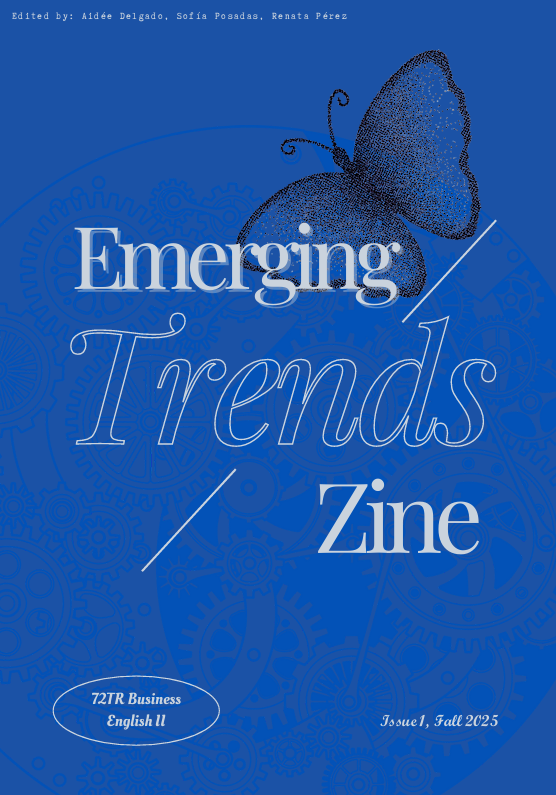

# Emerging Trends Zine

The **TR35 Business English Emerging Trends Zine** is a student-created publication that challenges conventional business thinking and imagines alternative futures for work, innovation, and technology.

As part of their Partial Exam 3, students contribute creative pieces—blackout poetry, manifestos, speculative scenarios, visual art, and more—that critically examine business buzzwords like "digital transformation," "disruption," and "innovation." Rather than accepting these terms at face value, contributors explore what they really mean, who they serve, and what alternative futures might look like.

This project is inspired by the Distributed AI Research Institute's [Imagining Possible Futures](https://www.dair-institute.org/imagining-possible-futures) workshop and zine, which invited participants to envision technological futures beyond dominant corporate narratives. Our zine brings this approach to business education, encouraging students to question assumptions and propose transformative alternatives.

---

## Issues and Releases

### Issue 1 – Fall 2025

**Contributors:** TR35 Business English II students, Fall 2025, Universidad Intercontinental

> **[View Issue 1 (PDF)](issues/EMERGING-TRENDS-ZINE-1.pdf)**

This inaugural issue features diverse perspectives on business innovation, the future of work, and technological transformation. Student contributors experimented with multiple formats to make bold statements about the status quo of business—and where it's headed and where it should go.

---

## How to Contribute

### Students Taking TR35

If you're currently enrolled in TR35 Business English, you'll contribute to the zine as part of Week 15's coursework. Your contribution—whether blackout poetry, manifesto, speculative scenario, or another creative format—will be compiled with your classmates' work into a new zine issue.

**See the full assignment:** [Emerging Business Trends Zine Assignment](../unit5/week15/emerging-business-trends-zine-assignment.md)

**Editors needed:** Each semester, we seek 2-3 student volunteers to serve as zine editors. Editors compile contributions, design the cover, and make editorial decisions about presentation. This role offers extra credit and recognition as a named editor on the publication.

### Instructors

If you're teaching a business communication, translation, or related course and want to create a zine with your students, you're welcome to adapt our assignment and share the results.

**To contribute your class's zine:**
1. Fork our [GitHub repository](https://github.com/alainamb/uic_tr35-business-english-II)
2. Add your zine issue to the `emerging-trends/issues/` folder
3. Submit a pull request with your contribution

All submissions are subject to quality review to ensure they align with the zine's critical, creative approach to business innovation.

### Individual Contributors

Have you written something that fits the zine's theme? We welcome standalone pieces that critically examine business trends, imagine alternative futures, or challenge dominant narratives about innovation and work.

**Individual contributions may be published as special releases** if they demonstrate:
- Critical thinking about business buzzwords and emerging trends
- Substantive engagement with the themes of transformation, innovation, or future of work
- Creative format or perspective
- Publication-ready quality

To propose an individual contribution, contact the course instructor through the GitHub repository.

---

## 📥 Download this Content
Find this file [on our repo](https://github.com/alainamb/uic_tr35-business-english-II/blob/main/emerging-trends/zine-page.md) and download it.

### 🤖 GAI Study Prompts
Copy the downloaded content and try it with these prompts:
- "What makes a zine different from a traditional publication, and why might this format be valuable for business students?"
- "Explain how the DAIR 'Imagining Possible Futures' project relates to critical thinking about business innovation"
- "What kinds of business assumptions might a zine contribution challenge that wouldn't be challenged in a traditional business essay?"
- "How can creative formats like zines complement professional business communication?"
- "What does it mean to critically examine business buzzwords rather than accept them at face value?"

---

**Thank you for checking out our zine! Ready for a challenge?** Continue to [Unit 1: Business Communication & Ethics](../unit1/unit1-overview.md) where we establish the communicative and ethical foundations for the course.