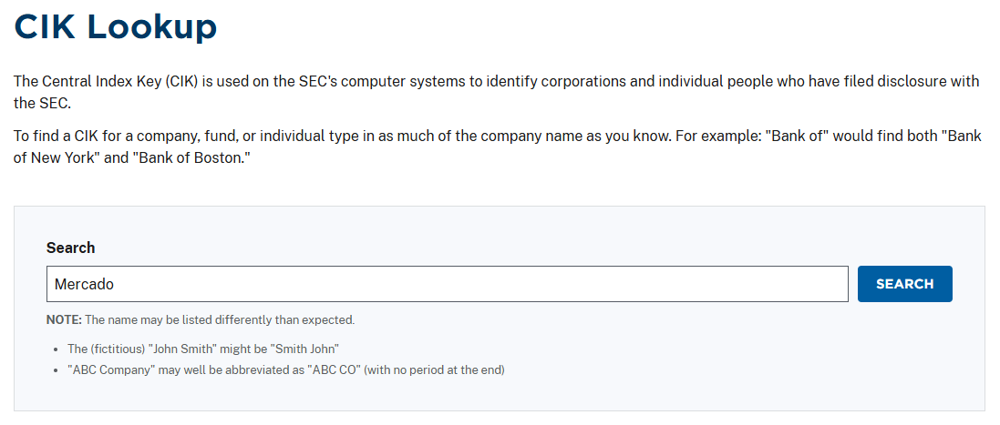
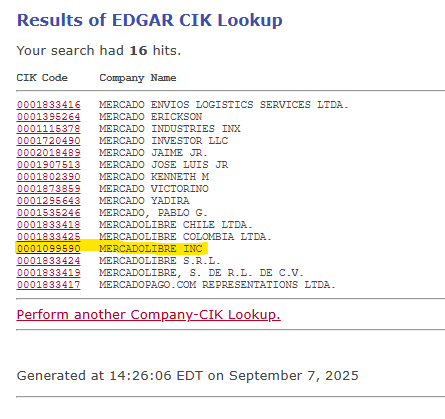
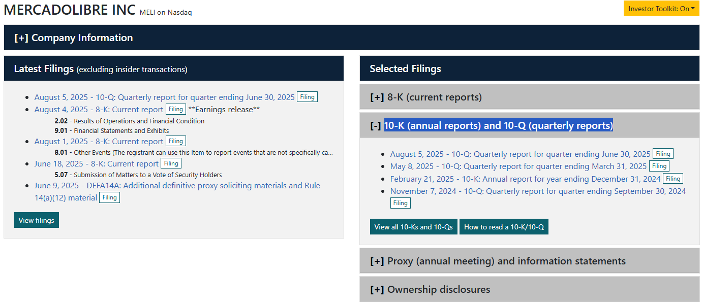

# Assignment: Financial Report Analysis (First Partial Exam)

**Due:** Sunday of Week 5  

**Points:** 10 points  

**Format:** Individual or group work (up to 3 members)

**Submission:** MS Word document via Teams

## Learning Objectives

By completing this assignment, you will:
- Navigate SEC filing systems to locate financial statements
- Extract key financial data from balance sheets and income statements
- Compare financial performance between time periods
- Write a professional business report in English
- Build vocabulary essential for business translation work

---

## Assignment Overview

You will write a 2-3 page financial analysis report about a publicly traded company using their most recent quarterly financial statements. This assignment builds on our Week 5 work with financial terminology and prepares you for translating business documents in your future career.

**Remember:** This is your first partial exam, so focus on clear communication and demonstrating your understanding of financial concepts we've studied in class.

---

## Report Requirements

### Structure (2-3 pages, double-spaced)

1. **Introduction** (1 paragraph)
   - Name the company and describe what business they operate
   - If the company has multiple entries in the CIK, differentiate the one you analyzed from the others
   - Explain which financial statements you analyzed (which quarter/year)

2. **Balance Sheet Summary** (1 paragraph + 1 table)
   - Create a simple table showing key balance sheet items
   - Compare two time periods (current vs. previous)
   - Explain whether assets and liabilities increased or decreased
   - Calculate the current ratio (current assets ÷ current liabilities) for both periods

3. **Income Statement Summary** (1 paragraph + 1 table)
   - Create a simple table showing key income statement items
   - Compare the same quarter from two different years
   - Explain whether revenue and profits increased or decreased
   - Calculate at least one profit margin (net income ÷ revenue)

4. **Synthesis of Your Analysis** (1 paragraph)
   - Based on your analysis, is the company's financial health improving or declining?
   - What does this tell you about the company's business performance?
   - Include one insight from outside research about how analysts view this company

5. **Conclusion** (1 paragraph)
   - Summarize your main findings
   - Reflect on what you learned about financial analysis
   - Connect this to your future work in translation/localization

6. **Works Consulted**
   - List SEC filings and any additional research sources

---

## Company Selection

Choose one company from this list. Each group must select a different company.

**Available Companies:**
- Nike, Inc.
- The Coca-Cola Company
- Nvidia Corporation
- Pfizer Inc.
- The Walt Disney Company
- McDonald's Corporation
- HubSpot, Inc.
- Xcel Energy Inc.
- eBay Inc.
- Datadog, Inc.
- Netflix.com, Inc.

**Alternative Option:** You may propose a different company by selecting one that has financial statements available on the U.S. Securities and Exchange Commission website. Companies [listed on the NASDAQ](https://stockanalysis.com/list/nasdaq-stocks) may be a good starting point for your search.

---

## Step-by-Step Instructions

### Step 1: Find Your Company's Financial Statements

1. Go to the SEC CIK Lookup: [https://www.sec.gov/search-filings/cik-lookup](https://www.sec.gov/search-filings/cik-lookup)

2. Search for your company name

   

3. Click on the CIK code in the results

   

4. Find the most recent **10-Q** (quarterly report)

   
   
5. Open the 10-Q and locate:
   - Consolidated Balance Sheets
   - Consolidated Statements of Income (or Operations)

### Step 2: Extract Financial Data

**For Balance Sheet - find these items:**
- Current Assets
- Total Assets  
- Current Liabilities
- Total Liabilities
- Total Equity

**For Income Statement - find these items:**
- Total Revenue (or Net Sales)
- Gross Profit
- Operating Income  
- Net Income

**Create simple tables like this:**

| Balance Sheet Item | Current Period | Previous Period | Change |
|-------------------|---------------|-----------------|---------|
| Current Assets | $X,XXX | $X,XXX | +X% |
| Total Assets | $X,XXX | $X,XXX | +X% |
| Current Liabilities | $X,XXX | $X,XXX | +X% |

### Step 3: Do Basic Calculations

**Current Ratio = Current Assets ÷ Current Liabilities**
- Above 1.0 = company can pay short-term debts
- Compare both time periods

**Net Profit Margin = Net Income ÷ Total Revenue × 100**
- Shows what percentage of sales becomes profit
- Compare both time periods

### Step 4: Research Context

Look up recent news articles or analyst reports about your company to understand:
- How experts view the company's performance
- Any major business developments affecting financial results
- Industry trends that might explain the numbers you found

### Step 5: Write Your Report

Follow the instructions on report structure above to write a report containing these sections:
- Introduction
- Balance Sheet Summary
- Income Statement Summary
- Synthesis of Your Analysis
- Conclusion
- Works Consulted
---

## Submission Details

- **File Format:** MS Word (.docx)  
- **File Name:** `GroupMembersFirstLastNames_[Company]-Financial-Report.docx`
  - **For example:** `Reyes-Brandt_MercadoLibre-Financial-Report.docx`
- **Upload Location:** Teams Assignment - Financial Report (Primer Parcial)  
- **Due Date:** Sunday of Week 5 by 11:59 PM

---

## Example Report Structure

See the [MercadoLibre Financial Analysis Example](mercadolibre-financial-report.md) on the next page for a model of:
- Professional tone appropriate for business writing
- How to present financial data in tables
- How to explain financial changes in simple terms
- How to draw reasonable conclusions from data

---

## Assessment Criteria (10 points total)

### Completeness (Instructions Followed) (2 points)
- All required sections included in report
- At least one calculation made per statement type (ratio, profit margin) for the correct period
- At least one insight from outside research included (also in Works Consulted)
- File named correctly according to the instructions

### Content Understanding & Accuracy (3 points)
- Correctly extracted financial data from SEC filings
- Accurate calculations of ratios and percentages
- Tables and data presented clearly

### Communication Effectiveness (3 points)
- Clear explanation of what the numbers mean
- Reasonable conclusions about company performance
- Evidence of understanding financial concepts from class

### Professionalism (2 points)
- Well-organized report structure
- Proper grammar and vocabulary usage
- Clear, professional English appropriate for business contexts

---

## 📥 Download This Assignment

Find this file [on our repo](https://github.com/alainamb/uic_tr35-business-english-II/blob/main/unit2/week5/assignment-financial-report.md) and download it!

### 🤖 AI Study Prompts
Use these prompts to help with your report:
- "Help me turn this screenshot of a balance sheet into an editable table for my report"
- "Explain what [specific financial term] means in simple business English"
- "Based on this financial data, help me understand if the company's performance is improving or declining"
- "Help me find recent news about [company name] financial performance"

---

**Next Activity:** [MercadoLibre Example Report](mercadolibre-financial-report.md)

